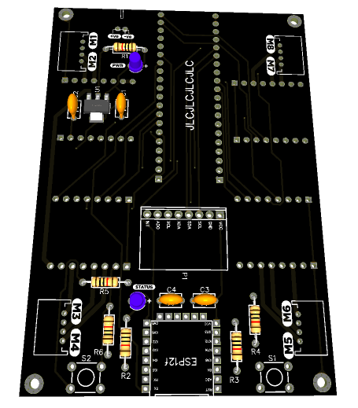

# Omircon Robot

Docs, Schematic and Board file for Hand Motion Controller and Mobile Platform main Computer for omicron robot.

## Contents

In this repo you'll find the following items:

### [Hand Motion Controller](HandMotion/)

This is the Hand Motion Controller capable to perceive hand motions and send it to the Mobile Platform main Computer.

### [Mobile Platform main Computer](MobilePlatform/)

This is a mobile platform main computer

